# Devops CI/CD

---
## Задачи:

1. Подготовить облачную инфраструктуру на базе облачного провайдера Яндекс.Облако.
2. Запустить и сконфигурировать Kubernetes кластер.
3. Установить и настроить систему мониторинга.
4. Настроить и автоматизировать сборку тестового приложения с использованием Docker-контейнеров.
5. Настроить CI/CD для автоматической сборки и развёртывания приложения.

---

## 1. Облачная инфраструктура на базе облачного провайдера Yandex Cloud. (с помощью Terraform)

1. Для начала создаем сервисный аккаунт:

```bash
$ yc iam service-account create sa

```

Даем ему права на редактирование (заменяем наш каталог):

```bash
$ yc resource-manager folder add-access-binding b1g259gr1ck7ejh9jd55 --role editor --subject serviceAccount:
done (1s)
```
Генерируем access и secret key:

```bash
$ yc iam access-key create --service-account-name sa
```

Добавляем ключи key_id и secret в provider.tf

Создаем бакет:
```bash
$ yc storage bucket create --name my-storage
```

Инициализируем backend:
```bash
terraform init
```

```bash
terraform workspace new prod
terraform workspace new stage
```

```bash
user@user:~/PycharmProjects/diplom$ terraform workspace list
  default
  prod
* stage
```

Конфигурация создаваемых машин описана в файлах папки Terraform.

Запуск сборки делаем с помощью команды:

```bash
#Смотрим предварительные изменения:
$ terraform plan
$ terraform apply
```
## 2. Запуск и конфигурация Kubernetes кластера.
Установим кластер kubernetes с помощью kubespray.
```bash
$ yc compute instance list
+----------------------+--------+---------------+---------+----------------+---------------+
|          ID          |  NAME  |    ZONE ID    | STATUS  |  EXTERNAL IP   |  INTERNAL IP  |
+----------------------+--------+---------------+---------+----------------+---------------+
| fhm2t0lgrbmpdm67psej | cp1    | ru-central1-a | RUNNING | 130.193.50.53  | 192.168.10.6  |
| fhmm4adq7u4gqjvkl9j8 | gitlab | ru-central1-a | RUNNING | 158.160.57.207 | 192.168.10.33 |
| fhmn0io6gtqcklee7tnp | node1  | ru-central1-a | RUNNING | 158.160.49.132 | 192.168.10.30 |
| fhmr6mb1k83e47kq72sd | node2  | ru-central1-a | RUNNING | 158.160.40.66  | 192.168.10.35 |
+----------------------+--------+---------------+---------+----------------+---------------+
```
Зайдем на control node, склонируем репозиторий kubespray и внесем свои параметры:
```bash
$ ssh ubuntu@130.193.50.53
$ git clone https://github.com/kubernetes-sigs/kubespray
$ sudo apt-get update
$ sudo apt install pip
```
```shell script
# Установка зависимостей
$ cd kubespray
$ sudo pip3 install -r requirements.txt

# Копирование примера в папку с вашей конфигурацией
$ cp -rfp inventory/sample inventory/mycluster

# Обновление Ansible inventory с помощью билдера 
declare -a IPS=(192.168.10.6 192.168.10.30 192.168.10.35)
CONFIG_FILE=inventory/mycluster/hosts.yaml python3 contrib/inventory_builder/inventory.py ${IPS[@]}

# 192.168.10.6 192.168.10.30 192.168.10.35 - адреса моих серверов
```

Билдер подготовит файл `inventory/mycluster/hosts.yaml`. Там будут прописаны адреса серверов, которые указали.
Остальные настройки нужно делать самостоятельно.

```bash
$ cat ~/kubespray/inventory/mycluster/hosts.yaml 
all:
  hosts:
    cp1:
      ansible_host: 192.168.10.6
      ip: 192.168.10.6
      access_ip: 192.168.10.6
      ansible_user: ubuntu
    node1:
      ansible_host: 192.168.10.30
      ip: 192.168.10.30
      access_ip: 192.168.10.30
      ansible_user: ubuntu
    node2:
      ansible_host: 192.168.10.35
      ip: 192.168.10.35
      access_ip: 192.168.10.35
      ansible_user: ubuntu
  children:
    kube_control_plane:
      hosts:
        cp1:
    kube_node:
      hosts:
        cp1:
        node1:
        node2:
    etcd:
      hosts:
        cp1:
    k8s_cluster:
      children:
        kube_control_plane:
        kube_node:
    calico_rr:
      hosts: {}
```

Добавим установку helm в наш кластер.

```bash
$ vim inventory/mycluster/group_vars/k8s_cluster/addons.yml
#Прописываем:
helm_enabled: true
```


Копируем приватный ключ ssh с хостовой машины на cp1 и раздаем права
```bash
$ ~/kubespray$ chmod 0700 /home/ubuntu/.ssh/id_rsa
```

Подключаемся к нодам по ssh и потом запускаем установку кластера:

```bash
ansible-playbook -i inventory/mycluster/hosts.yaml cluster.yml -b -v
```

Копируем конфиг из папки по умолчанию:
```bash
mkdir -p $HOME/.kube
sudo cp -i /etc/kubernetes/admin.conf $HOME/.kube/config
sudo chown $(id -u):$(id -g) $HOME/.kube/config
```

Копируем адрес control node для настройки доступа с удаленного пк и еще раз запускаем сборку:
```bash
$ vim inventory/mycluster/group_vars/k8s_cluster/k8s-cluster.yml

#Прописываем в этот параметр:
supplementary_addresses_in_ssl_keys: [158.160.59.76]

ansible-playbook -i inventory/mycluster/hosts.yaml cluster.yml -b -v
```
```bash
$ kubectl version
WARNING: This version information is deprecated and will be replaced with the output from kubectl version --short.  Use --output=yaml|json to get the full version.
Client Version: version.Info{Major:"1", Minor:"25", GitVersion:"v1.25.6", GitCommit:"ff2c119726cc1f8926fb0585c74b25921e866a28", GitTreeState:"clean", BuildDate:"2023-01-18T19:22:09Z", GoVersion:"go1.19.5", Compiler:"gc", Platform:"linux/amd64"}
Kustomize Version: v4.5.7
Server Version: version.Info{Major:"1", Minor:"25", GitVersion:"v1.25.6", GitCommit:"ff2c119726cc1f8926fb0585c74b25921e866a28", GitTreeState:"clean", BuildDate:"2023-01-18T19:15:26Z", GoVersion:"go1.19.5", Compiler:"gc", Platform:"linux/amd64"}

$ kubectl get po,svc,deployment -o wide
NAME                            READY   STATUS    RESTARTS   AGE   IP            NODE    NOMINATED NODE   READINESS GATES
pod/frontend-68b6c85c69-lw99f   1/1     Running   0          23h   10.233.75.2   node2   <none>           <none>

NAME                 TYPE        CLUSTER-IP     EXTERNAL-IP   PORT(S)        AGE   SELECTOR
service/kubernetes   ClusterIP   10.233.0.1     <none>        443/TCP        29h   <none>
service/nodeport     NodePort    10.233.8.142   <none>        80:32180/TCP   23h   app=frontend

NAME                       READY   UP-TO-DATE   AVAILABLE   AGE   CONTAINERS   IMAGES                     SELECTOR
deployment.apps/frontend   1/1     1            1           23h   nginx        alexeiemelin/nginx:1.0.0   app=frontend

$ kubectl get pods --all-namespaces
NAMESPACE     NAME                                       READY   STATUS    RESTARTS   AGE
default       frontend-68b6c85c69-lw99f                  1/1     Running   0          23h
kube-system   calico-kube-controllers-7967fb4566-sm2k5   1/1     Running   0          29h
kube-system   calico-node-6hqkr                          1/1     Running   0          29h
kube-system   calico-node-hksqb                          1/1     Running   0          29h
kube-system   calico-node-vj6pw                          1/1     Running   0          29h
kube-system   coredns-68868dc95b-7nlxm                   1/1     Running   0          29h
kube-system   coredns-68868dc95b-w5rs5                   1/1     Running   0          29h
kube-system   dns-autoscaler-7ccd65764f-sjnrb            1/1     Running   0          29h
kube-system   kube-apiserver-cp1                         1/1     Running   0          29h
kube-system   kube-controller-manager-cp1                1/1     Running   1          29h
kube-system   kube-proxy-brf7j                           1/1     Running   0          28h
kube-system   kube-proxy-chrfd                           1/1     Running   0          28h
kube-system   kube-proxy-v9cpv                           1/1     Running   0          28h
kube-system   kube-scheduler-cp1                         1/1     Running   1          29h
kube-system   nginx-proxy-node1                          1/1     Running   0          29h
kube-system   nginx-proxy-node2                          1/1     Running   0          29h
kube-system   nodelocaldns-5bbfv                         1/1     Running   0          29h
kube-system   nodelocaldns-t7kfq                         1/1     Running   0          29h
kube-system   nodelocaldns-x9t4g                         1/1     Running   0          29h
```

Добавим доступ к ноде с домашнего пк. Для этого создадим и заполним context
```bash
$ vim ~/.kube/config 

#Cкопируем раздел cluster и user с ноды, поменяем адрес с localhost на внешний
apiVersion: v1
clusters:
- cluster:
    certificate-authority-data: 
    server: https://158.160.59.76:6443
  name: kubespray
contexts:
- context:
    cluster: kubespray
    namespace: default
    user: kubespray
  name: kubespray

users:
- name: kubespray
  user:
```

```bash
#Применим настройки и проверим доступ
$ kubectl config use-context kubespray
Switched to context "kubespray".

$ kubectl get nodes
NAME    STATUS   ROLES           AGE   VERSION
cp1     Ready    control-plane   29h   v1.26.1
node1   Ready    <none>          29h   v1.26.1
node2   Ready    <none>          29h   v1.26.1
```

Пишем deployment.yml нашего будущего приложения:

```bash
apiVersion: apps/v1
kind: Deployment
metadata:
  labels:
    app: frontend
  name: frontend
  namespace: default
spec:
  replicas: 1
  selector:
    matchLabels:
      app: frontend
  template:
    metadata:
      labels:
        app: frontend
    spec:
      containers:
      - image: "{{ .Values.image.repository }}:{{ .Values.image.tag }}"
        name: nginx
        imagePullPolicy: IfNotPresent
---
apiVersion: v1
kind: Service
metadata:
  name: nodeport
  namespace: default
spec:
  ports:
    - name: http
      port: 80
      protocol: TCP
      nodePort: 32180
  selector:
    app: frontend
  type: NodePort
```

## 3. Установка и настройка системы мониторинга. Деплоим стек grafana/prometheus/node-exporeter:

Ставим через репозиторий на control node:

```bash
#Через репозиторий
git clone git@github.com:prometheus-operator/kube-prometheus.git
cd kube-prometheus
kubectl apply --server-side -f manifests/setup
kubectl wait \
	--for condition=Established \
	--all CustomResourceDefinition \
	--namespace=monitoring
kubectl apply -f manifests/
```

На локальной машине запускаем проброс трафика для доступа к grafana:

```bash
kubectl --namespace monitoring port-forward svc/grafana 3000
```
Теперь можем зайти в админку через браузер:
```html
http://localhost:3000/
```
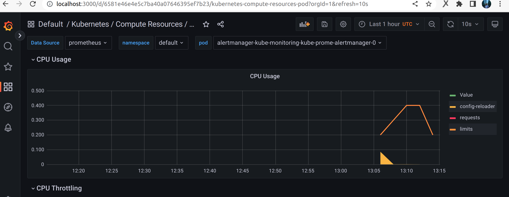
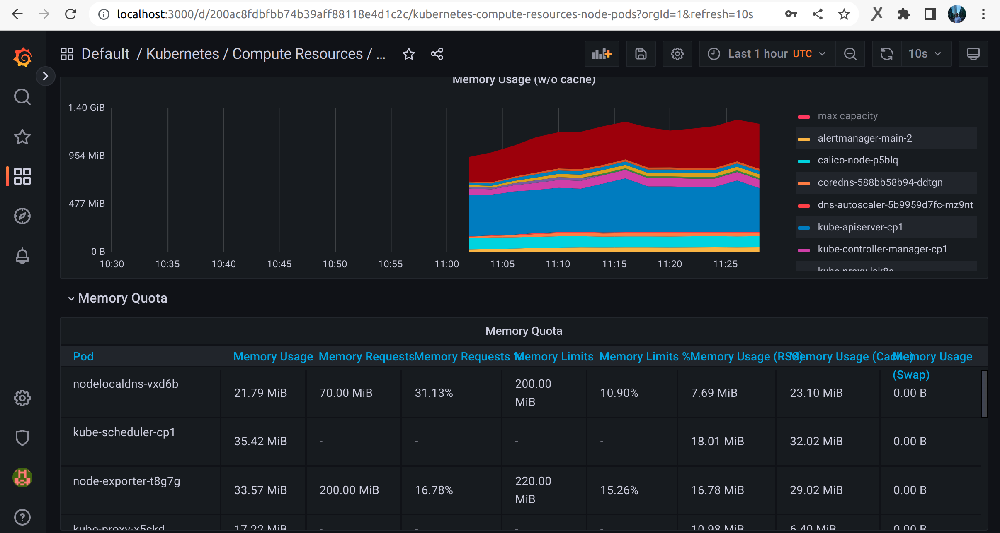
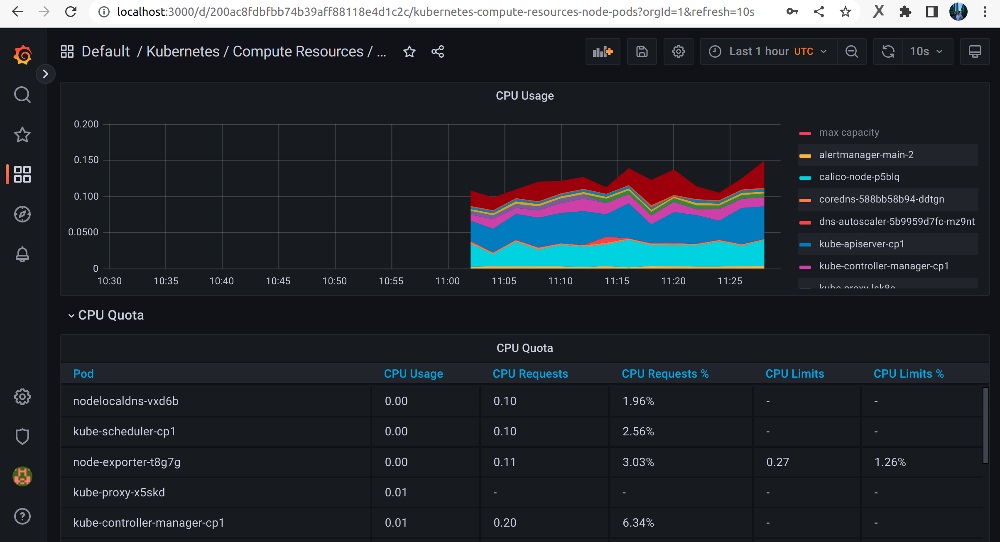
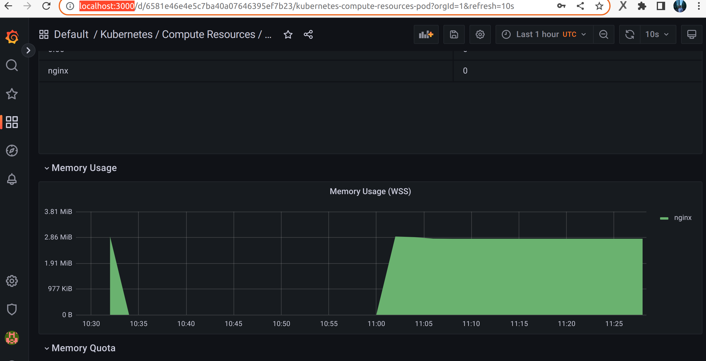

## 4. Настройка и автоматизация сборки приложения с использованием Docker и Helm.

Создаем наше приложение (поднимем сайт с помощью nginx):

Создаем docker image из Dockerfile:
```bash
docker build -t alexeiemelin/nginx:v1 .
```

И загружаем его на hub.docker:
```bash
docker push alexeiemelin/nginx:v1
```

https://hub.docker.com/r/alexeiemelin/nginx

Устанавливаем helm на пк для того, чтобы сделать наш chart:
```bash
curl -fsSL -o get_helm.sh https://raw.githubusercontent.com/helm/helm/master/scripts/get-helm-3
chmod 700 get_helm.sh
./get_helm.sh
```

Cоздаем чарт:
```bash
helm create my_nginx
```

Удаляем лишние файлы, созданные автоматически и заменяем своими (values.yaml, Chart.yaml, deployment.yml):
```bash
rm -rf my_nginx/templates/*
```

Проверяем, что значения из файла values.yaml корректно подставляются: 
```bash
helm template my_nginx
```

Проверяем синтаксис:
```bash
helm lint my_nginx
```

## 5. Настроиваем Gitlab CI/CD для автоматической сборки и развёртывания приложения.

В конфиге terraform у нас уже подготовлена вм для gitlab с образом от yandex.
Настраиваем gitlab и gitlab runner по инструкции от yandex cloud:
https://cloud.yandex.ru/docs/tutorials/testing/ci-for-snapshots

Устанавливаем на этой машине helm и docker, а так же важно установить kubectl под пользователем
gitlab-runner, т.к. именно под ним выполняются все команды в gitlab ci.
Для этого логинимся под этим пользователем через root пользователя и выполняем установку согласно инструкции:

```bash
sudo -i -u gitlab-runner
```

Создаем на gitlab репозиторий, загружаем туда наш Dockerfile и приложение my_nginx

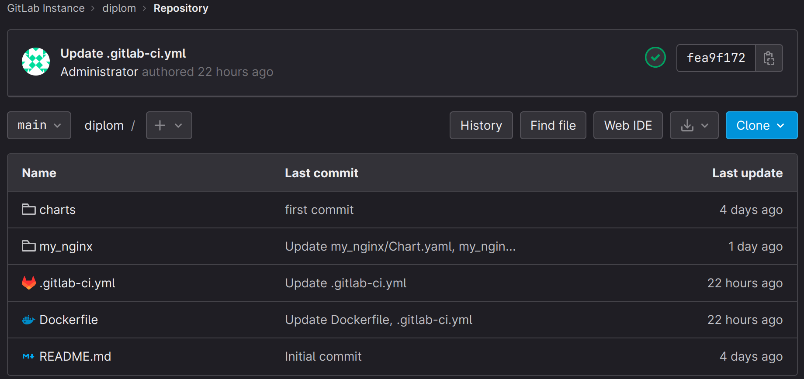

Создаем файл .gitlab-ci.yml
Он содержит pipeline из двух stage. Stage build_docker при коммите в репозиторий запускает сборку 
образа приложения и пушит его в docker hub с заданной версией. 
Stage build helm производит установку обновленного приложения прямо в кластер, 
т.к. на раннере у нас уже настроен доступ к ноде через kubectl и context.

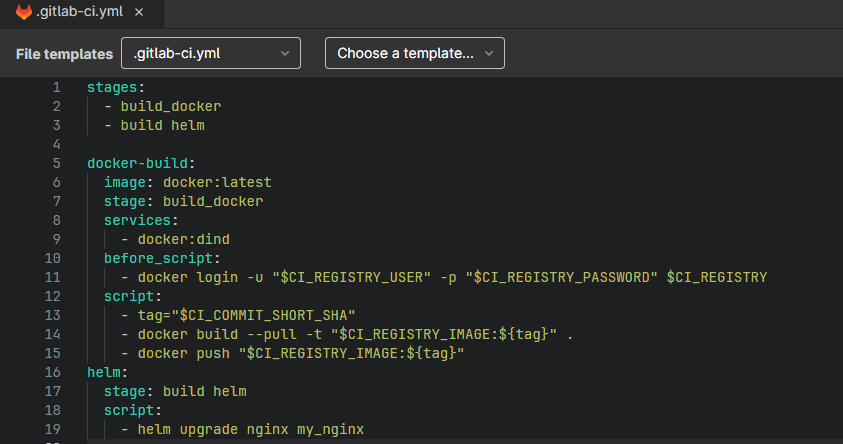

Переменные прописываем здесь:

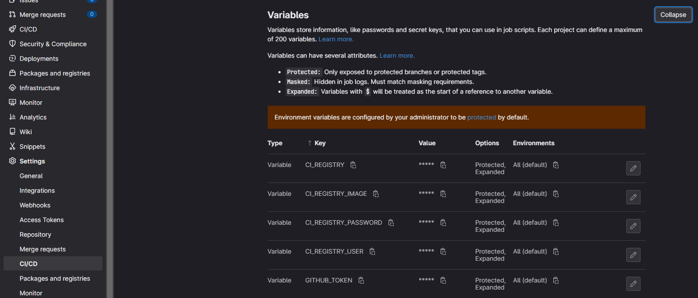

Pipeline CI/CD:

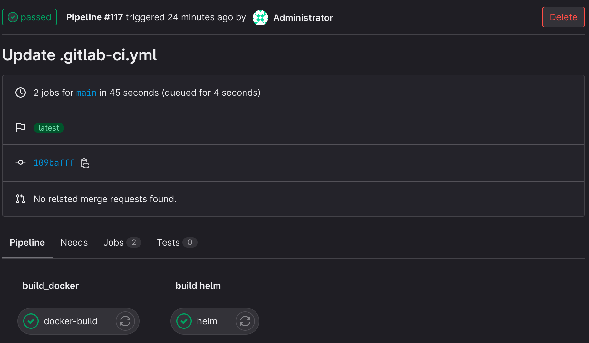

Helm deploy:

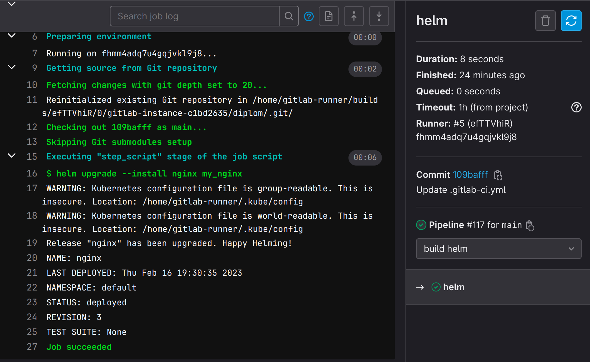

Результат - наш сайт:

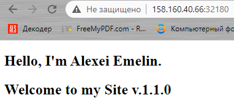

Тэг для docker image берется из коммита через переменную Gitlab CI:

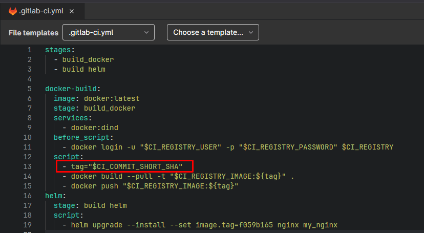

Чтобы раскрутить определенную версию приложения, мы пропишем нужный tag в пайплайне через --set

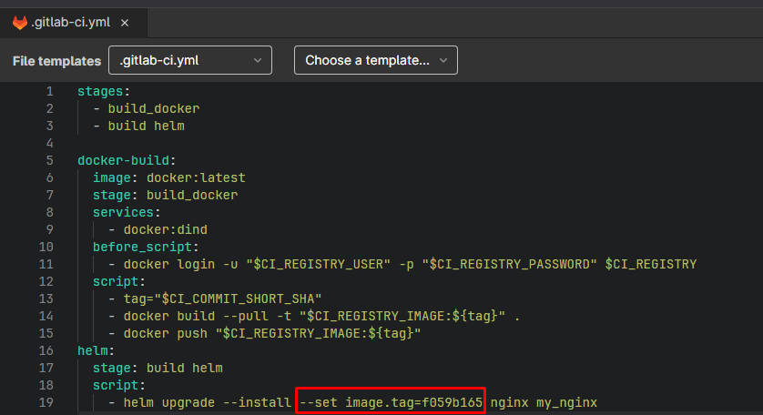
